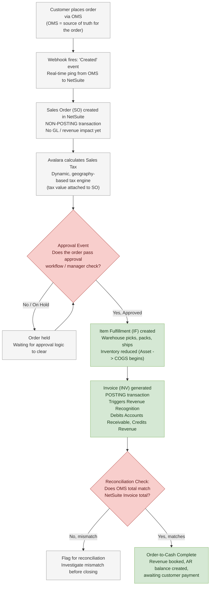
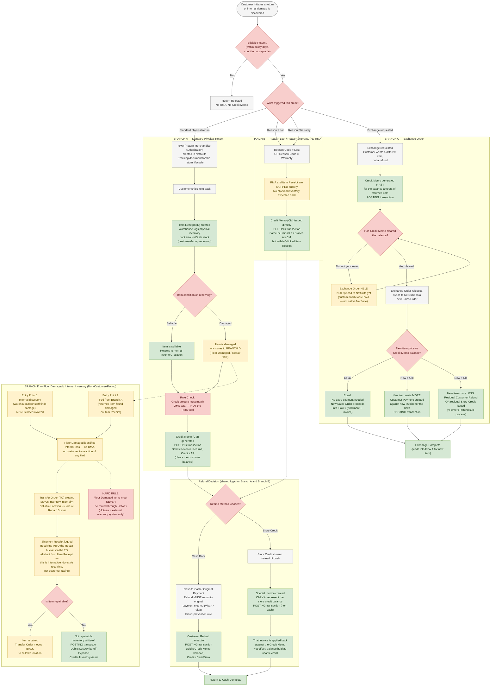

# NetSuite Business Model — Complete Flow Diagrams

*This file has two master diagrams: Flow 1 (Sales Order — forward, Order-to-Cash) and Flow 2 (Return & Exchange — reverse, Return-to-Cash). Every term from your notes is placed exactly where it happens in the business process, with the accounting nature of each step labeled (posting vs non-posting, GL impact, revenue/AR/inventory effect).*

---

## Legend — Accounting Nature of Each Box

| Color / Style | Meaning |
|---|---|
| 🟦 Blue box | Standard processing step |
| 🟥 Red diamond | Decision point |
| 🟩 Green box | Financial transaction that **posts to the General Ledger** (has real accounting/GL impact) |
| 🟨 Yellow box | Internal / non-customer-facing inventory step |
| ⬜ Grey box | Non-posting transaction (record only, no GL impact yet) |

---

## Flow 1: Sales Order — Complete (Order-to-Cash / O2C)

**Reading this flow (in accounting words):**
- **Sales Order** = a commitment record only — nothing hits your books yet.
- **Item Fulfillment** = physical inventory starts moving; this is where the seed of Cost of Goods Sold (COGS) begins, though it isn't formally expensed until invoicing in most NetSuite setups.
- **Invoice** = the real accounting moment — this is what actually creates **Revenue** and **Accounts Receivable (AR)**. Before this, nothing has "happened" financially.
- **OMS-vs-NetSuite total match** is a control check — it exists because the OMS is the system of record for what the customer actually agreed to pay, and NetSuite must reflect exactly that, not a different number from RMS.

---

## Flow 2: Return & Exchange — Complete (Return-to-Cash / R2C)

This is the big one. It has **four branches** hanging off one entry gate:
- **Branch A** — Standard physical return (RMA path)
- **Branch B** — Reason Lost / Reason Warranty (no physical item, no RMA)
- **Branch C** — Exchange Order (its own financial hold logic)
- **Branch D** — Floor Damaged / Internal Inventory (not customer-facing at all — shown as its own zone, but connected wherever a real return can feed into it)

---

## Reading Branch D "Beautifully" — Why It's Drawn This Way

Branch D is intentionally isolated from the customer-facing branches because, in accounting terms, **it is a completely different kind of event**:

| | Branch A / B / C (Customer Returns) | Branch D (Floor Damaged) |
|---|---|---|
| Who is involved | Customer + Company | Company only (internal) |
| Triggering document | RMA or direct Credit Memo | Transfer Order (TO) |
| Customer balance affected? | Yes — AR/Credit Memo | No — no customer record touched at all |
| GL impact | Revenue reversal, AR reduction | Inventory write-off or repair-in-progress (no revenue impact) |
| Receiving document used | **Item Receipt** (customer return) | **Shipment Receipt** (internal/TO receiving) |

That's why the diagram gives Branch D **two separate entry points**:
1. A standalone trigger (staff finds damage on the floor — nothing to do with any customer).
2. A dotted-line feed from Branch A (a customer's returned item turns out to be damaged when received) — this is the only bridge between the customer world and the internal world, and it's drawn as a **dotted line** on purpose, to show it's a conditional handoff, not a normal step in sequence.

The **hard rule** — Floor Damaged must never touch Hotwax — is drawn as a decision-style box directly under the trigger, because it's a boundary check your team explicitly called out, not just a note.

---

## Every Term — Where It Lives (Quick Index)

| Term | Flow | Branch |
|---|---|---|
| OMS | Flow 1 | Entry point |
| NetSuite | Both | Core system throughout |
| RMS | — | Explicitly excluded from totals-matching check |
| Hotwax | Flow 2 | Branch D (explicitly excluded) |
| Avalara | Flow 1 | Tax step |
| Webhook | Flow 1 | Order creation trigger |
| Sales Order (SO) | Flow 1 | Core step |
| Item Fulfillment (IF) | Flow 1 | Core step |
| Invoice (INV) | Flow 1 / Branch C | Core step / exchange pricing |
| RMA | Flow 2 | Branch A only |
| Item Receipt (IR) | Flow 2 | Branch A only |
| Credit Memo (CM) | Flow 2 | Branch A, B, C |
| Customer Refund | Flow 2 | Refund sub-process |
| Transfer Order (TO) | Flow 2 | Branch D |
| Eligible Return | Flow 2 | Entry gate |
| Cash-to-Cash / Original Payment | Flow 2 | Refund sub-process |
| Store Credit Refund | Flow 2 | Refund sub-process |
| Exchange Order | Flow 2 | Branch C |
| Floor Damaged | Flow 2 | Branch D |
| Reason Lost / Reason Warranty | Flow 2 | Branch B |
| Approval Event | Flow 1 | Gate before fulfillment |
| Shipment Receipt | Flow 2 | Branch D only |

Every term from your three source documents is placed above — nothing left out.