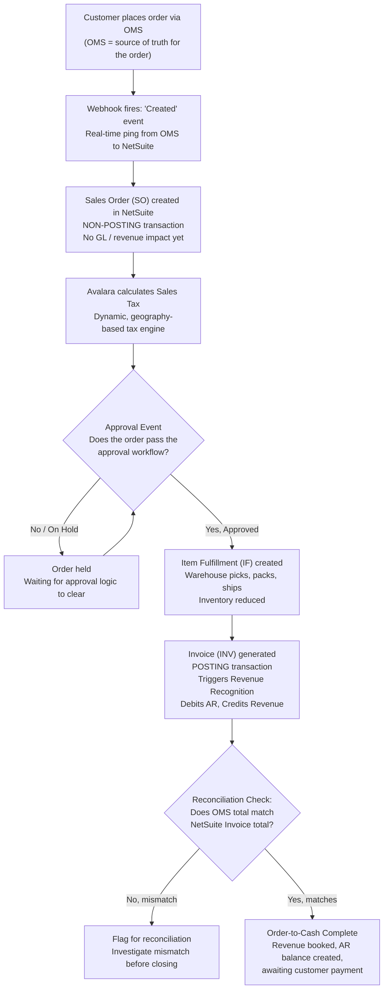

```mermaid
flowchart TD

    START(["Customer initiates a return<br/>or internal damage is discovered"])
    ELIG{"Eligible Return?<br/>(within policy days,<br/>condition acceptable)"}
    REJECT["Return Rejected<br/>No RMA, No Credit Memo"]

    START --> ELIG
    ELIG -- "No" --> REJECT
    ELIG -- "Yes" --> REASON{"What triggered this credit?"}

    %% ================= BRANCH A: STANDARD RETURN =================
    subgraph BranchA["BRANCH A — Standard Physical Return"]
        direction TB
        A1["RMA (Return Merchandise Authorization)<br/>created in NetSuite<br/>Tracking document for the return lifecycle"]
        A2["Customer ships item back"]
        A3["Item Receipt (IR) created<br/>Warehouse logs physical inventory<br/>back into NetSuite stock"]
        A4{"Item condition on receiving?"}
        A5["Item is sellable<br/>Returns to normal inventory location"]
        A6["Item is damaged<br/>--> routes to BRANCH D<br/>(Floor Damaged / Repair flow)"]
        A7{"Rule Check:<br/>Credit amount must match<br/>OMS total — NOT the RMS total"}
        A8["Credit Memo (CM) generated<br/>POSTING transaction<br/>Debits Revenue/Returns, Credits AR"]

        A1 --> A2 --> A3 --> A4
        A4 -- "Sellable" --> A5 --> A7
        A4 -- "Damaged" --> A6 --> A7
        A7 --> A8
    end

    %% ================= BRANCH B: LOST / WARRANTY =================
    subgraph BranchB["BRANCH B — Reason Lost / Reason Warranty (No RMA)"]
        direction TB
        B1["Reason Code = Lost<br/>OR Reason Code = Warranty"]
        B2["RMA and Item Receipt are SKIPPED entirely<br/>No physical inventory expected back"]
        B3["Credit Memo (CM) issued directly<br/>POSTING transaction<br/>No linked Item Receipt"]

        B1 --> B2 --> B3
    end

    %% ================= REFUND SUB-PROCESS (shared by A & B) =================
    subgraph REFUND["Refund Decision (shared logic for Branch A and Branch B)"]
        direction TB
        R1{"Refund Method Chosen?"}
        R2["Cash-to-Cash / Original Payment<br/>Refund MUST return to original<br/>payment method (Visa -> Visa)"]
        R3["Customer Refund transaction<br/>POSTING transaction<br/>Debits Credit Memo, Credits Cash/Bank"]
        R4["Store Credit chosen instead of cash"]
        R5["Special Invoice created<br/>ONLY to represent the store credit balance<br/>POSTING transaction (non-cash)"]
        R6["That Invoice is applied back<br/>against the Credit Memo<br/>CM is now fully applied / closed"]

        R1 -- "Cash Back" --> R2 --> R3
        R1 -- "Store Credit" --> R4 --> R5 --> R6
    end

    %% ================= BRANCH C: EXCHANGE =================
    subgraph BranchC["BRANCH C — Exchange Order"]
        direction TB
        C1["Exchange requested<br/>Customer wants a different item,<br/>not a refund"]
        C2["Credit Memo generated FIRST<br/>for the balance amount of returned item"]
        C3{"Has Credit Memo cleared<br/>the balance?"}
        C4["Exchange Order HELD<br/>NOT synced to NetSuite yet<br/>(custom middleware hold)"]
        C5["Exchange Order releases,<br/>syncs to NetSuite as a<br/>new Sales Order"]
        C6{"New item price vs<br/>Credit Memo balance?"}
        C7["Equal:<br/>No extra payment needed<br/>New Sales Order proceeds<br/>into Flow 1 (fulfillment + invoice)"]
        C8["New item costs MORE:<br/>Customer Payment created<br/>against new Invoice for the delta"]
        C9["New item costs LESS:<br/>Residual Customer Refund<br/>OR residual Store Credit issued<br/>(re-enters Refund sub-process)"]

        C1 --> C2 --> C3
        C3 -- "No, not yet cleared" --> C4 --> C3
        C3 -- "Yes, cleared" --> C5 --> C6
        C6 -- "Equal" --> C7
        C6 -- "New > Old" --> C8
        C6 -- "New < Old" --> C9
    end

    %% ================= BRANCH D: FLOOR DAMAGE / INTERNAL INVENTORY =================
    subgraph BranchD["BRANCH D — Floor Damaged / Internal Inventory (Non-Customer-Facing)"]
        direction TB
        D0["Entry Point 1:<br/>Internal discovery<br/>(warehouse/floor staff finds damage)<br/>NO customer involved"]
        D0b["Entry Point 2:<br/>Fed from Branch A<br/>(returned item found damaged<br/>on Item Receipt)"]
        D1["Floor Damaged identified<br/>Internal loss — no RMA,<br/>no customer transaction"]
        D2["Transfer Order (TO) created<br/>Moves inventory internally:<br/>Sellable Location --> virtual 'Repair' Bucket"]
        D3["Shipment Receipt logged<br/>Receiving INTO the Repair bucket via the TO<br/>(distinct from Item Receipt —<br/>internal receiving, not customer-facing)"]
        D4{"Is item repairable?"}
        D5["Item repaired<br/>Transfer Order moves it BACK<br/>to sellable location"]
        D6["Not repairable:<br/>Inventory Write-off<br/>POSTING transaction<br/>Debits Loss/Write-off Expense,<br/>Credits Inventory Asset"]
        D7{"HARD RULE:<br/>Floor Damaged items must NEVER<br/>be routed through Hotwax<br/>(Hotwax = external warranty system only)"}

        D0 --> D1
        D0b --> D1
        D1 --> D2 --> D3 --> D4
        D4 -- "Yes" --> D5
        D4 -- "No" --> D6
        D1 -.-> D7
    end

    %% ================= CREDIT MEMO / STORE CREDIT LIFECYCLE MANAGEMENT =================
    subgraph CMLIFE["Credit Memo & Store Credit — Ongoing Balance Management"]
        direction TB
        L1["Store Credit Invoice sits as an<br/>OPEN balance on the customer record<br/>(this is the customer's usable 'wallet')"]
        L2["Customer places a NEW order later<br/>(separate Sales Order, separate day)"]
        L3["At payment step of new order,<br/>customer chooses to apply Store Credit"]
        L4["Payment Application transaction created<br/>Applies existing Store Credit Invoice balance<br/>against the NEW Invoice"]
        L5{"Is Store Credit balance<br/>fully used by this application?"}
        L6["Store Credit Invoice fully closed<br/>Balance = 0, nothing left to track"]
        L7["Store Credit Invoice stays OPEN<br/>with a smaller remaining balance<br/>available for a future order"]
        L8{"Company policy:<br/>does unused Store Credit expire?"}
        L9["If policy defines an expiry window<br/>and it passes unused:<br/>Remaining balance written off<br/>(POSTING: Expense/Breakage entry)"]
        L10["If no expiry policy,<br/>balance simply remains open<br/>indefinitely until used"]

        L1 --> L2 --> L3 --> L4 --> L5
        L5 -- "Yes, fully used" --> L6
        L5 -- "No, partially used" --> L7 --> L8
        L8 -- "Yes, expires" --> L9
        L8 -- "No expiry" --> L10
    end

    %% ================= MAIN ROUTING =================
    REASON -- "Standard physical return" --> A1
    REASON -- "Reason: Lost" --> B1
    REASON -- "Reason: Warranty" --> B1
    REASON -- "Exchange requested" --> C1

    A8 --> R1
    B3 --> R1

    A6 -.-> D0b

    R3 --> DONE1(["Return-to-Cash Complete"])
    R6 --> L1
    C7 --> DONE2(["Exchange Complete<br/>(feeds into Flow 1 for new item)"])
    C8 --> DONE2
    C9 --> R1
```

# NetSuite Business Model — Complete Flow Diagrams

*Two master diagrams: Flow 1 (Sales Order — forward, Order-to-Cash) and Flow 2 (Return & Exchange — reverse, Return-to-Cash). No color-coding — shapes alone tell you the type of step: rectangles are process steps, diamonds are decisions, rounded stadium shapes are start/end points.*

---

## Flow 1: Sales Order — Complete (Order-to-Cash / O2C)



**Reading this flow (in accounting words):**
- **Sales Order** = a commitment record only — nothing hits your books yet.
- **Item Fulfillment** = physical inventory starts moving; the seed of Cost of Goods Sold (COGS) begins here.
- **Invoice** = the real accounting moment — this creates **Revenue** and **Accounts Receivable (AR)**.
- **OMS-vs-NetSuite total match** is a control check — the OMS is the system of record for what the customer agreed to pay, and NetSuite must reflect exactly that, not a different number from RMS.

---

## Flow 2: Return & Exchange — Complete (Return-to-Cash / R2C)

Four branches hang off one entry gate:
- **Branch A** — Standard physical return (RMA path)
- **Branch B** — Reason Lost / Reason Warranty (no physical item, no RMA)
- **Branch C** — Exchange Order (its own financial hold logic)
- **Branch D** — Floor Damaged / Internal Inventory (not customer-facing)

...and a new piece at the end: **how a Credit Memo and Store Credit actually get managed over time**, not just created once.



---

## How a Credit Memo Becomes "Store Credit" — And What Happens After

This part often gets skipped in explanations because most diagrams stop at *"Credit Memo applied to Invoice, done."* But in real operations, that Store Credit doesn't just disappear — it becomes a **standing balance** the customer can spend later. Here's the full lifecycle in plain words:

1. **Creation moment:** When a customer picks Store Credit instead of cash, NetSuite doesn't refund anything. Instead, it creates a special **Invoice** whose only job is to represent that credit amount, and applies it against the original **Credit Memo**. At this point, the Credit Memo is "used up" — but the Invoice now holds that value as an open balance for the customer.

2. **The waiting period:** That Invoice balance just sits there — it's the customer's usable wallet. Nothing more happens until the customer places another order.

3. **Spending it:** On a future order, at the payment step, if the customer chooses to apply Store Credit, NetSuite creates a **Payment Application** — a separate transaction that links the old Store Credit Invoice's balance to the new order's Invoice.

4. **Partial vs full use:** If the new order's amount is bigger than the remaining Store Credit, the credit is fully consumed and the customer pays the difference normally. If the new order is smaller, only part of the Store Credit is used, and the Invoice stays open with a smaller balance — ready for a third order, a fourth, and so on.

5. **The expiry question:** Whether unused Store Credit ever "disappears" depends entirely on company policy, not on NetSuite itself. If your policy has an expiry window, an unused balance eventually gets written off as a company expense (sometimes called "breakage" in retail accounting). If there's no such policy, the balance just stays open forever until the customer uses it.

---

## Every Term — Where It Lives (Quick Index)

| Term | Flow | Branch |
|---|---|---|
| OMS | Flow 1 | Entry point |
| NetSuite | Both | Core system throughout |
| RMS | — | Explicitly excluded from totals-matching check |
| Hotwax | Flow 2 | Branch D (explicitly excluded) |
| Avalara | Flow 1 | Tax step |
| Webhook | Flow 1 | Order creation trigger |
| Sales Order (SO) | Flow 1 | Core step |
| Item Fulfillment (IF) | Flow 1 | Core step |
| Invoice (INV) | Flow 1 / Branch C | Core step / exchange pricing |
| RMA | Flow 2 | Branch A only |
| Item Receipt (IR) | Flow 2 | Branch A only |
| Credit Memo (CM) | Flow 2 | Branch A, B, C + CM/Store Credit lifecycle |
| Customer Refund | Flow 2 | Refund sub-process |
| Transfer Order (TO) | Flow 2 | Branch D |
| Eligible Return | Flow 2 | Entry gate |
| Cash-to-Cash / Original Payment | Flow 2 | Refund sub-process |
| Store Credit Refund | Flow 2 | Refund sub-process + CM/Store Credit lifecycle |
| Exchange Order | Flow 2 | Branch C |
| Floor Damaged | Flow 2 | Branch D |
| Reason Lost / Reason Warranty | Flow 2 | Branch B |
| Approval Event | Flow 1 | Gate before fulfillment |
| Shipment Receipt | Flow 2 | Branch D only |
| Payment Application (new) | Flow 2 | Store Credit lifecycle only |

Every term from your source documents is placed above — nothing left out.

========================== NEW FLOW DETAILED FOR SALES ORDER =======================================
# NetSuite Business Model — Complete Flow Diagrams

*Two master diagrams: Flow 1 (Sales Order — forward, Order-to-Cash) and Flow 2 (Return & Exchange — reverse, Return-to-Cash). No color-coding — shapes alone tell you the type of step: rectangles are process steps, diamonds are decisions, rounded stadium shapes are start/end points.*

---

## Flow 1: Sales Order — Complete (Order-to-Cash / O2C)

*This is the full detailed version — every branch, every NetSuite-specific mechanism (idempotency, custom fields, batch APIs), and every payment/fulfillment scenario in one diagram.*

```mermaid
flowchart TD

    subgraph ENTRY["Order Entry & Payload — OMS to NetSuite"]
        direction TB
        OA["Order placed via OMS<br/>Channel: Web / App / POS / Marketplace"]
        OB["OMS builds Order Payload<br/>(see sample payload below diagram)"]
        OC["Custom Fields resolved onto payload<br/>Read from NetSuite Custom Field Definitions<br/>(synced earlier via scheduled job)<br/>One data row per field — config-driven, not hardcoded"]
        OD["Webhook: 'Order Created' event<br/>POST payload to NetSuite RESTlet / SuiteTalk endpoint"]
        OE{"Payload accepted?<br/>(schema valid, auth token valid,<br/>idempotency key present)"}
        OE1["Reject / Retry Queue<br/>Integration error record created<br/>Alert raised, exponential backoff retry"]
        OF{"Idempotency Check:<br/>Does a Sales Order already exist<br/>for this OMS Order ID?"}
        OF1["Skip creation<br/>Return existing SO's internal ID<br/>(prevents duplicate SO on webhook retry)"]
        OG["Sales Order (SO) created in NetSuite<br/>NON-POSTING transaction<br/>External ID = OMS Order ID<br/>Custom fields written using<br/>NetSuite internal field IDs"]

        OA --> OB --> OC --> OD --> OE
        OE -- "No" --> OE1 --> OD
        OE -- "Yes" --> OF
        OF -- "Yes, exists" --> OF1
        OF -- "No, new" --> OG
    end

    subgraph PAYPREF["Payment Preference at Order Time"]
        direction TB
        OH{"Payment Preference on Order?"}
        OI["Prepaid Card:<br/>Authorization (hold) created<br/>NO GL entry yet — just a hold<br/>Captured later at Invoice stage"]
        OJ["Customer Deposit:<br/>Customer Deposit record created<br/>POSTING: Dr Cash, Cr Customer Deposit (Liability)<br/>Linked to this Sales Order"]
        OK["Net Terms (B2B):<br/>No payment now<br/>Invoice will carry a due date (e.g. Net 30)"]
        OL["Exchange Order Re-Entry:<br/>(arrives from Return Flow, Branch C)<br/>sourceOrderPaymentPreferenceId links this<br/>new SO back to the original payment/Credit Memo<br/>No new cash collected — settled via CM balance"]

        OH -- "Card, pay now" --> OI
        OH -- "Deposit paid upfront" --> OJ
        OH -- "Net terms" --> OK
        OH -- "Exchange replacement order" --> OL
    end

    OG --> OH

    subgraph TAX["Tax Calculation — Avalara Integration"]
        direction TB
        OM["Avalara Tax Calculation call<br/>Payload: ship-from, ship-to,<br/>item tax codes, exemption flag"]
        ON{"Customer marked<br/>Tax Exempt?"}
        OO["Apply Exemption Certificate<br/>Tax = 0 on eligible lines"]
        OP["Avalara returns tax per line<br/>+ jurisdiction breakdown<br/>Written back onto SO lines"]

        OM --> ON
        ON -- "Yes" --> OO
        ON -- "No" --> OP
    end

    OI --> OM
    OJ --> OM
    OK --> OM
    OL --> OM

    subgraph APPROVAL["Approval Event — Credit / Fraud / Discount Check"]
        direction TB
        OQ{"Needs manual approval?<br/>(credit hold, fraud score,<br/>discount above threshold)"}
        OQ1["Order held<br/>Routed to approver queue"]
        OQ2{"Approver Decision"}
        OQ3["Rejected:<br/>SO closed / cancelled<br/>Release card authorization<br/>OR refund Customer Deposit"]
        OQ4["Approved — proceed"]

        OQ -- "Yes, review needed" --> OQ1 --> OQ2
        OQ2 -- "Rejected" --> OQ3
        OQ2 -- "Approved" --> OQ4
        OQ -- "No, auto-approved" --> OQ4
    end

    OO --> OQ
    OP --> OQ

    subgraph ALLOC["Inventory Allocation & Sourcing"]
        direction TB
        OR{"Where does this order<br/>get sourced from?"}
        OS["Single location has full stock<br/>Allocate entire order there"]
        OT["Split across locations<br/>Multiple partial allocations created"]
        OU["Drop-Ship:<br/>Purchase Order created to Vendor<br/>Vendor ships directly to customer<br/>Vendor Bill received separately"]
        OV["Out of stock everywhere:<br/>Backorder / Pre-Order flow<br/>(separate Future Inventory Item ledger)"]

        OR -- "Full stock, 1 location" --> OS
        OR -- "Stock split" --> OT
        OR -- "Vendor fulfills directly" --> OU
        OR -- "No stock anywhere" --> OV
    end

    OQ4 --> OR

    subgraph FULFILL["Item Fulfillment — Full / Partial / Drop-Ship"]
        direction TB
        OW["Item Fulfillment (IF) created<br/>Per shipment / per location<br/>Payload: tracking number, ship method,<br/>package weight, ship date<br/>POSTING: Dr COGS, Cr Inventory (lines shipped)"]
        OX{"All order lines<br/>shipped in this IF?"}
        OY["Full Fulfillment<br/>Single IF covers entire SO"]
        OZ["Partial Fulfillment<br/>Remaining lines stay OPEN on the SO<br/>Another IF created later when<br/>backordered/split stock arrives"]

        OW --> OX
        OX -- "Yes, all lines" --> OY
        OX -- "No, lines remain" --> OZ
    end

    OS --> OW
    OT --> OW
    OU --> OW
    OV -.->|"stock finally arrives"| OW
    OZ -.->|"loop back for next shipment"| OW

    subgraph BILL["Billing Schedule & Invoice Generation"]
        direction TB
        PA{"Invoice per Fulfillment<br/>or Consolidated Invoice?"}
        PB["Invoice created per Item Fulfillment<br/>(multiple invoices over time<br/>for a multi-shipment order)"]
        PC["Single consolidated Invoice<br/>created only after FINAL fulfillment"]
        PD["Invoice (INV) generated<br/>POSTING: Dr Accounts Receivable, Cr Revenue<br/>Custom fields carried from SO to INV<br/>(same field definitions, same data rows)"]
        PE{"Reconciliation Check:<br/>Does OMS line total match<br/>this NetSuite Invoice total?<br/>(never compared against RMS)"}
        PE1["Flag for reconciliation<br/>Investigate before marking order synced"]

        PA -- "Per fulfillment" --> PB --> PD
        PA -- "Consolidated" --> PC --> PD
        PD --> PE
        PE -- "No, mismatch" --> PE1
    end

    OY --> PA
    OZ --> PA

    subgraph SETTLE["Settlement — Payment Application"]
        direction TB
        PF{"How is this Invoice settled?"}
        PG["Capture Authorization Hold<br/>(from prepaid card)<br/>POSTING: Dr Cash, Cr AR"]
        PH["Apply Customer Deposit to Invoice<br/>Pushed via NetSuite REST Batch API<br/>(batched, polled, ledger row updated<br/>with NetSuite id or refusal)<br/>POSTING: Dr Customer Deposit (Liability), Cr AR"]
        PI["Apply Credit Memo balance<br/>(Exchange re-entry case)<br/>POSTING: Dr Credit Memo balance, Cr AR"]
        PJ["Net Terms:<br/>Invoice stays OPEN on AR<br/>until Customer Payment received later"]
        PK{"Card Declined?"}
        PK1["Retry / Dunning process<br/>Invoice remains unpaid<br/>Escalate to collections if repeated failure"]
        PK2["Customer Payment received<br/>POSTING: Dr Cash, Cr AR"]

        PF -- "Card capture" --> PG --> PK
        PK -- "Yes, declined" --> PK1 --> PK
        PF -- "Deposit application" --> PH
        PF -- "Credit Memo (exchange)" --> PI
        PF -- "Net terms, pay later" --> PJ --> PK2
    end

    PE -- "Yes, matches" --> PF

    PL{"Is AR balance now<br/>fully zero for this Invoice?"}
    PM["Invoice remains open<br/>Partial payment recorded,<br/>remaining balance still due"]
    PN["Invoice fully paid"]

    PK -- "No, captured OK" --> PL
    PH --> PL
    PI --> PL
    PK2 --> PL
    PL -- "No, balance remains" --> PM
    PL -- "Yes, zero" --> PN

    PO{"All order lines fulfilled<br/>AND all invoices fully paid?"}
    PP["Order-to-Cash Complete<br/>Fully Fulfilled + Fully Invoiced + Fully Paid<br/>Revenue booked, COGS matched, AR = 0"]

    PN --> PO
    PO -- "No, more shipments/invoices pending" --> OW
    PO -- "Yes" --> PP
```



### Sample Webhook Payload (OMS → NetSuite)

This is roughly what the OMS sends when the order is created — note the `customFields` array, which is never hardcoded field names; it's built at runtime from whatever the NetSuite field-definition sync says this record type needs.

```json
{
  "orderId": "OMS-100234",
  "orderDate": "2026-09-10T10:15:00Z",
  "customerId": "CUST-88291",
  "channelId": "WEB",
  "currency": "INR",
  "items": [
    { "itemId": "SKU-A100", "qty": 1, "unitPrice": 6000, "taxCode": "TX-STD" },
    { "itemId": "SKU-B200", "qty": 1, "unitPrice": 4000, "taxCode": "TX-STD" }
  ],
  "shipTo": { "address1": "...", "city": "...", "postalCode": "..." },
  "paymentPreference": {
    "type": "DEPOSIT",
    "depositId": "DEP-5521",
    "sourceOrderPaymentPreferenceId": null
  },
  "customFields": [
    { "internalId": "custbody_channel_ref", "recordType": "salesorder", "value": "WEB" },
    { "internalId": "custbody_store_pickup_flag", "recordType": "salesorder", "value": "N" }
  ]
}
```

### How Custom Fields Are Actually Handled

| Piece | What It Does | Where It Comes From |
|---|---|---|
| NetSuite Custom Field Definition | The master list of fields that exist on a NetSuite record type (e.g. Sales Order, Customer Deposit) | Synced from the NetSuite account itself — not written in code |
| `get#NetSuiteCustomFieldsForRecordType` | A service that returns exactly which custom fields a given record type should carry | Reads the synced definitions above |
| Data row per field | One config row = one field mapping (internal ID + value source) | Maintained as data, so adding a new field never needs a code deploy |
| Runtime payload | The OMS looks up the config rows for "salesorder" and stamps matching values onto the JSON payload | Assembled fresh on every order — always reflects current NetSuite field setup |

This is exactly why adding a new custom field to NetSuite later doesn't require touching the integration code — it only requires a new data row.

### Reading This Flow (In Accounting Words)

- **Sales Order** = a commitment record only — nothing hits your books yet. The **idempotency check** exists purely so a retried webhook never creates a second SO for the same order.
- **Authorization Hold** (prepaid card) and **Sales Order** are both non-posting — a card hold is not a sale, it's a promise the bank makes to you.
- **Customer Deposit** is the first real GL entry that can happen in this flow — it's a **liability**, not revenue, because you haven't earned it yet; you just owe the customer either goods or their money back.
- **Item Fulfillment** is where **COGS** first appears — NetSuite reduces Inventory and books COGS the moment goods physically leave the building, even before the Invoice exists.
- **Invoice** is where **Revenue** and **Accounts Receivable** are born.
- Settlement (capturing a card, applying a Deposit, applying a Credit Memo, or collecting a Net-Terms payment) is what eventually drives AR back to **zero** — that's the real finish line, not just "Invoice created."
- **OMS-vs-NetSuite total match** is a control check — the OMS is the system of record for what the customer agreed to pay, and NetSuite must reflect exactly that, never a number from RMS.

---

## Ledger / Journal — Full Worked Example (Order-to-Cash)

Here's a complete numeric walkthrough so you can see exactly how the books stay balanced from order placement to full close — including a deposit, a partial (split) shipment, and a final card capture.

**Setup:** Order has 2 items — Item A (₹6,000, cost ₹4,000) ships immediately; Item B (₹4,000, cost ₹2,000) is backordered and ships later. Customer pays a ₹3,000 Deposit upfront; the rest is paid by card as each invoice comes due.

| # | Event | Debit | Credit | Amount (₹) |
|---|---|---|---|---|
| 1 | Sales Order created | — | — | (no GL entry — non-posting) |
| 2 | Customer Deposit received upfront | Cash | Customer Deposit (Liability) | 3,000 |
| 3 | Item Fulfillment 1 — Item A ships | COGS | Inventory | 4,000 |
| 4 | Invoice 1 generated — Item A (₹6,000) | Accounts Receivable | Revenue | 6,000 |
| 5 | Apply Deposit to Invoice 1 | Customer Deposit (Liability) | Accounts Receivable | 3,000 |
| 6 | Card captured for remaining Invoice 1 balance | Cash | Accounts Receivable | 3,000 |
| 7 | Item Fulfillment 2 — Item B ships (backorder cleared) | COGS | Inventory | 2,000 |
| 8 | Invoice 2 generated — Item B (₹4,000) | Accounts Receivable | Revenue | 4,000 |
| 9 | Card captured for Invoice 2 in full | Cash | Accounts Receivable | 4,000 |

### Running Balances After Each Step

| # | AR Balance | Customer Deposit Liability | Cumulative Revenue | Cumulative COGS | Cash Balance |
|---|---|---|---|---|---|
| 1 | 0 | 0 | 0 | 0 | 0 |
| 2 | 0 | 3,000 | 0 | 0 | 3,000 |
| 3 | 0 | 3,000 | 0 | 4,000 | 3,000 |
| 4 | 6,000 | 3,000 | 6,000 | 4,000 | 3,000 |
| 5 | 3,000 | 0 | 6,000 | 4,000 | 3,000 |
| 6 | 0 | 0 | 6,000 | 4,000 | 6,000 |
| 7 | 0 | 0 | 6,000 | 6,000 | 6,000 |
| 8 | 4,000 | 0 | 10,000 | 6,000 | 6,000 |
| 9 | 0 | 0 | 10,000 | 6,000 | 10,000 |

**Final state — Order-to-Cash Complete:**
- Accounts Receivable = **₹0** (fully paid)
- Customer Deposit Liability = **₹0** (fully consumed)
- Total Revenue = **₹10,000**
- Total COGS = **₹6,000**
- Cash collected = **₹10,000**
- **Profit = Revenue − COGS = ₹4,000**

This is the exact test for "is this order truly closed": AR is zero, the Deposit liability is zero, every line has a matching Item Fulfillment, and every Invoice has a matching payment. If any of those four aren't true yet, the order is still open somewhere in the flow above — even if it looks "done" on the surface.

### Extra Terms Introduced in This Detailed Flow

| Term | What It Means |
|---|---|
| Idempotency Key | A unique value (the OMS Order ID) used so a retried webhook never creates a duplicate Sales Order |
| Authorization Hold | A card pre-check that reserves funds without moving any money — not a GL transaction |
| Customer Deposit | A liability account representing money received before it's been earned as revenue |
| Drop-Ship | Vendor ships directly to the customer; NetSuite tracks it via a Purchase Order + Vendor Bill instead of your own warehouse's Item Fulfillment |
| Backorder / Pre-Order | When no location has stock; the order line waits, tracked separately, until inventory becomes available |
| Consolidated Invoice | One Invoice covering multiple Item Fulfillments, instead of one Invoice per shipment |
| Payment Application | The transaction that links an existing balance (Deposit, Credit Memo, or Customer Payment) to a specific open Invoice |
| Dunning | The retry/reminder process that runs when a card is declined or a Net-Terms invoice goes overdue |

---

## Flow 2: Return & Exchange — Complete (Return-to-Cash / R2C)

Four branches hang off one entry gate:
- **Branch A** — Standard physical return (RMA path)
- **Branch B** — Reason Lost / Reason Warranty (no physical item, no RMA)
- **Branch C** — Exchange Order (its own financial hold logic)
- **Branch D** — Floor Damaged / Internal Inventory (not customer-facing)

...and a new piece at the end: **how a Credit Memo and Store Credit actually get managed over time**, not just created once.


---

## How a Credit Memo Becomes "Store Credit" — And What Happens After

This part often gets skipped in explanations because most diagrams stop at *"Credit Memo applied to Invoice, done."* But in real operations, that Store Credit doesn't just disappear — it becomes a **standing balance** the customer can spend later. Here's the full lifecycle in plain words:

1. **Creation moment:** When a customer picks Store Credit instead of cash, NetSuite doesn't refund anything. Instead, it creates a special **Invoice** whose only job is to represent that credit amount, and applies it against the original **Credit Memo**. At this point, the Credit Memo is "used up" — but the Invoice now holds that value as an open balance for the customer.

2. **The waiting period:** That Invoice balance just sits there — it's the customer's usable wallet. Nothing more happens until the customer places another order.

3. **Spending it:** On a future order, at the payment step, if the customer chooses to apply Store Credit, NetSuite creates a **Payment Application** — a separate transaction that links the old Store Credit Invoice's balance to the new order's Invoice.

4. **Partial vs full use:** If the new order's amount is bigger than the remaining Store Credit, the credit is fully consumed and the customer pays the difference normally. If the new order is smaller, only part of the Store Credit is used, and the Invoice stays open with a smaller balance — ready for a third order, a fourth, and so on.

5. **The expiry question:** Whether unused Store Credit ever "disappears" depends entirely on company policy, not on NetSuite itself. If your policy has an expiry window, an unused balance eventually gets written off as a company expense (sometimes called "breakage" in retail accounting). If there's no such policy, the balance just stays open forever until the customer uses it.

---

## Every Term — Where It Lives (Quick Index)

| Term | Flow | Branch |
|---|---|---|
| OMS | Flow 1 | Entry point |
| NetSuite | Both | Core system throughout |
| RMS | — | Explicitly excluded from totals-matching check |
| Hotwax | Flow 2 | Branch D (explicitly excluded) |
| Avalara | Flow 1 | Tax step |
| Webhook | Flow 1 | Order creation trigger |
| Sales Order (SO) | Flow 1 | Core step |
| Item Fulfillment (IF) | Flow 1 | Core step |
| Invoice (INV) | Flow 1 / Branch C | Core step / exchange pricing |
| RMA | Flow 2 | Branch A only |
| Item Receipt (IR) | Flow 2 | Branch A only |
| Credit Memo (CM) | Flow 2 | Branch A, B, C + CM/Store Credit lifecycle |
| Customer Refund | Flow 2 | Refund sub-process |
| Transfer Order (TO) | Flow 2 | Branch D |
| Eligible Return | Flow 2 | Entry gate |
| Cash-to-Cash / Original Payment | Flow 2 | Refund sub-process |
| Store Credit Refund | Flow 2 | Refund sub-process + CM/Store Credit lifecycle |
| Exchange Order | Flow 2 | Branch C |
| Floor Damaged | Flow 2 | Branch D |
| Reason Lost / Reason Warranty | Flow 2 | Branch B |
| Approval Event | Flow 1 | Gate before fulfillment |
| Shipment Receipt | Flow 2 | Branch D only |
| Payment Application (new) | Flow 2 | Store Credit lifecycle only |

Every term from your source documents is placed above — nothing left out.